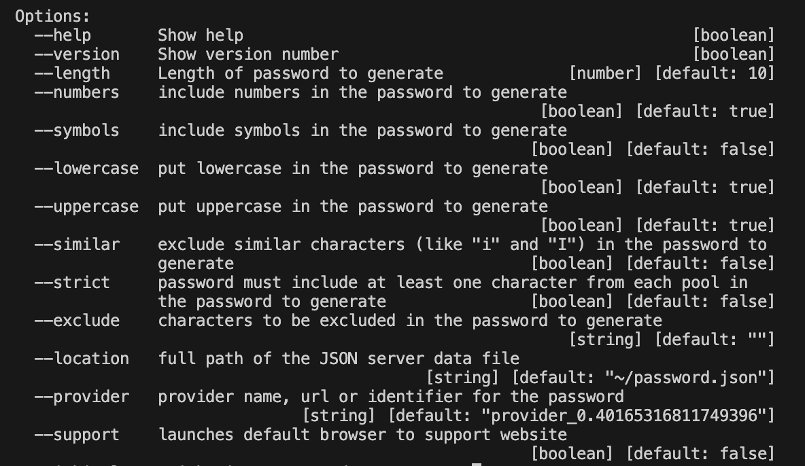

# Password Generator

This utility came out of necessity when my online providers ask me to change my password and I have run out of options.

The command line options are,



When the constant **PROTECT** is false, the **--location** parameter will show the full path location of your **password.json** file, when executing the command

```
password-generator --help
```

or

```
node index.js --help
```

## Building Executables

Using electron-builder to create distributable executables for Mac, Windows and Linux for a command line nodejs application on a Mac M1.

You need to install mono for MacOS and wine for Linux/MacOS host builds, in order to build a win32 package,

```
brew install mono
brew install wine
```

First install electron and electron-builder as development dependencies,

```
npm install electron --save-dev
npm install electron-builder --save-dev
```

then create a 256x256 PNG logo, the script txt2image.sh will create a PNG in the assets directory from a text string

then create a Mac ICNS image from the PNG using the icns_creator.sh script

then add a build section to the package.json, specifiying the icon for each platform and some additional metadata,

```
"build": {
    "appId": "biz.pingleware.password-generator",
    "productName": "PasswordGenerator",
    "win": {
      "target": "portable",
      "icon": "./assets/logo.png"
    },
    "linux": {
      "target": "AppImage",
      "category": "utility",
      "icon": "./assets/logo.png"
    },
    "mac": {
      "icon": "./assets/logo.icns"
    }
},
```

like the appId and productName,

To build for each platform, run the following command,

To build a mac universal application,

```
npm run dist:mac
```

To build a windows universal portable,

```
npm run dist:win
```

To build a linux AppImage for supported platforms,

npm run dist:linux

you will then have the following distributable filss in the dist/ directory,

```
PasswordGenerator 1.0.0.exe
PasswordGenerator-1.0.0-arm64.AppImage
PasswordGenerator-1.0.0-armv7l.AppImage
PasswordGenerator-1.0.0.AppImage
PasswordGenerator-1.0.0-universal-mac.zip
PasswordGenerator-1.0.0-universal.dmg
```

These files were built on a Mac M1 without spawning any VM.

After change linux target to deb, the following linux files become available in the dist/ directory,

```
password-generator_1.0.0_amd64.deb
password-generator_1.0.0_armv7l.deb
password-generator_1.0.0_amd64.AppImage
password-generator_1.0.0_armv7l.AppImage
password-generator_1.0.0_amd64.snap
password-generator_1.0.0_armv7l.snap
```

To build the arm64 version of linux, which spawns a multipass VM,

`npm run dist:linux:arm64`

which will build

```
password-generator_1.0.0_arm64.deb
password-generator_1.0.0_arm64.AppImage
password-generator_1.0.0_arm64.snap
```

## Password Rules

The following table includes password rules for known online providers,

| PROVIDER        | PASSWORD RULES                                                                                                                                                                                                                                                                                                                  | OPTIONS                                        |
| --------------- | ------------------------------------------------------------------------------------------------------------------------------------------------------------------------------------------------------------------------------------------------------------------------------------------------------------------------------- | ---------------------------------------------- |
| GOOGLE          | **Length:** Passwords must be 8 characters or longer.<br />**Complexity:** The password must contain letters, numbers, and special characters.<br />**Combination:** Make sure you don’t use predictable combinations of words, such as name, date of birth, or words combined with numbers like 123.        | --provider=google --length=20 --strict=true    |
| MICROSOFT       | At least 12 characters long but 14 or more is better.<br />A combination of uppercase letters, lowercase letters, numbers, and symbols.<br />Significantly different from your previous passwords.<br />Easy for you to remember but difficult for others to guess. Consider using a memorable phrase like "6MonkeysRLooking^". | --provider=microsoft --length=20 --strict=true |
| APPLE           | Apple requires that you use a strong password for your Apple ID—eight or more characters, including upper and lowercase letters and at least one number                                                                                                                                                                        | --provider=apple --length=20 --strict=true     |
| MICROSOFT AZURE | Password must have 3 of the following: 1 lower case character, 1 upper case character, 1 number, and 1 special character.<br />The value must be between 12 and 123 characters long.                                                                                                                                            | --provider=azure --length=20 --strict=true     |
